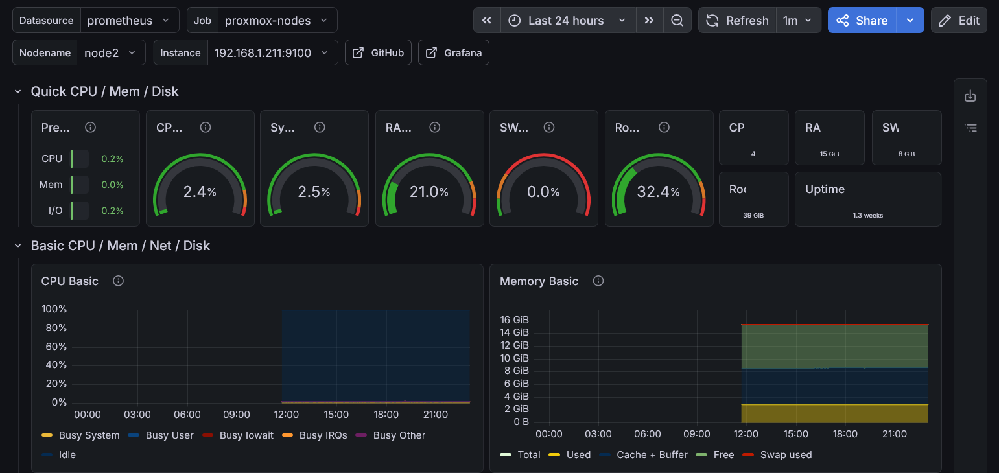
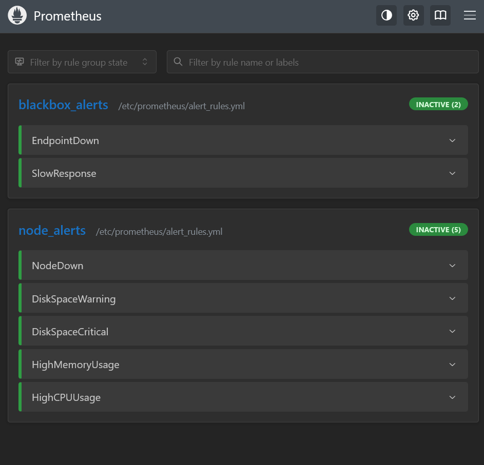
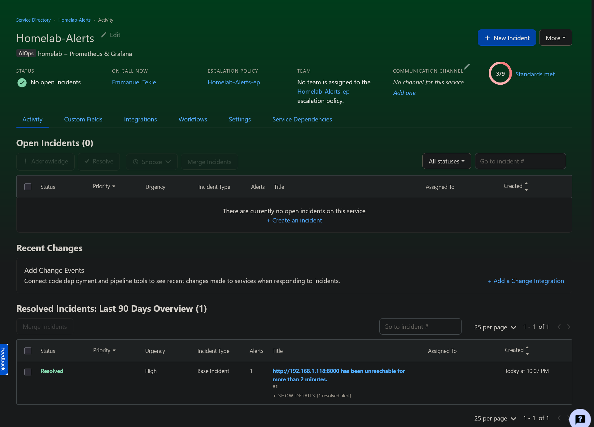

# Homelab

My self-hosted infrastructure running on a 3-node Proxmox VE cluster. Started as a way to learn more about systems administration and grew into a full monitoring + backup setup that I manage alongside my Cybersecurity & Cloud studies.

Everything here — the monitoring pipeline, alerting, dashboards — was configured manually. No helper scripts, no one-click installers for the monitoring stack. I wanted to actually understand what each config line does, not just have something that works.

## The Setup

Three nodes, all consumer-grade hardware (Dell OptiPlex, HP ProDesk), running Proxmox VE 9 in a cluster with HA enabled.

| Node | IP | OS Disk | Extra Storage |
|------|-----|---------|---------------|
| pve | 192.168.1.249 | 238GB NVMe | 931GB HDD (ZFS pool) |
| node2 | 192.168.1.211 | 119GB NVMe | — |
| node3 | 192.168.1.74 | 119GB SSD | — |

The ZFS pool on pve handles all backup storage. No shared storage (Ceph would need an extra disk per node), so HA failover copies the disk over — takes a few minutes instead of seconds, but that's fine for a homelab.

## What's Running

| Service | What it does |
|---------|-------------|
| **Prometheus + Grafana** | Monitoring — the main project in this repo |
| **Alertmanager → PagerDuty** | Alerts straight to my phone when something breaks |
| **blackbox_exporter** | Checks if my services are actually responding |
| **Pi-hole** | DNS ad blocking for the whole network |
| **Nginx Proxy Manager** | Reverse proxy + SSL |
| **Vaultwarden** | Password manager (Bitwarden compatible) |
| **Paperless-ngx** | Document management with OCR |
| **UrBackup** | Pulls backups from my Windows machines automatically |
| **Glance** | Dashboard / start page |

## Monitoring Stack

This is the core of the project. Full write-up in [`/monitoring`](./monitoring/).

The short version:

```
node_exporter on each host
        ↓
Prometheus (scrapes every 15s)
        ↓
   ┌────┴────┐
Grafana    Alertmanager → PagerDuty → my phone
```

Plus blackbox_exporter for HTTP checks on all services.

I went with PagerDuty over simpler options (Telegram, ntfy) because it's what most companies actually use, and I wanted the experience of setting up proper incident management — escalation policies, acknowledgements, the works.

### Alerts I have configured

| Alert | When it fires | Severity |
|-------|--------------|----------|
| NodeDown | Can't reach a node for 1 min | Critical |
| DiskSpaceWarning | Disk > 85% for 5 min | Warning |
| DiskSpaceCritical | Disk > 95% for 2 min | Critical |
| HighMemoryUsage | RAM > 90% for 5 min | Warning |
| HighCPUUsage | CPU > 95% for 10 min | Warning |
| EndpointDown | Service not responding for 2 min | Critical |
| SlowResponse | Response time > 5s for 5 min | Warning |

## Screenshots

### Grafana — Cluster Overview (custom dashboard)


### Prometheus — All targets UP


### PagerDuty — Incident from test alert


## Architecture Diagram

```
                  ┌───────────────┼───────────────┐
                  │               │               │
           ┌──────┴──────┐ ┌─────┴──────┐ ┌──────┴──────┐
           │    pve       │ │   node2    │ │   node3     │
           │ .249         │ │ .211       │ │ .74         │
           │              │ │            │ │             │
           │ Paperless    │ │ Pi-hole    │ │             │
           │ UrBackup     │ │ Nginx PM  │ │             │
           │              │ │ Glance    │ │             │
           │ ZFS Pool     │ │ Vaultwarden│ │             │
           │ (931GB)      │ │ Monitoring│ │             │
           └──────────────┘ └───────────┘ └─────────────┘
```

All nodes connected via Tailscale for remote access. No ports exposed to the internet.

## Repo Structure

```
├── docs/
│   ├── architecture.md         Detailed infra documentation
│   └── Infrastructure-setup    Setup notes
├── monitoring/
│   ├── prometheus/             Scrape config + alert rules
│   ├── alertmanager/           PagerDuty routing config
│   ├── blackbox_exporter/      HTTP/TCP/ICMP probe definitions
│   ├── grafana/dashboards/     Exported dashboard JSON
│   ├── node_exporter/          Systemd service for hosts
│   └── systemd/                Service files for all components
├── Screenshots/                Dashboard + alert screenshots
└── .gitignore
```

## What I Learned

Setting this up from scratch taught me more than any tutorial could:

- How Prometheus actually works under the hood (pull model, TSDB, PromQL)
- Writing PromQL queries that make sense, not just copy-pasting from Stack Overflow
- Why Alertmanager exists separately from Prometheus (grouping, routing, silencing)
- How companies handle incidents with PagerDuty (on-call, escalation, acknowledgement)
- The difference between "it works" and "I understand why it works"

The monitoring stack took the longest to get right — not because it's hard to install, but because understanding what each metric means, choosing the right thresholds, and building dashboards that actually help you takes time.
