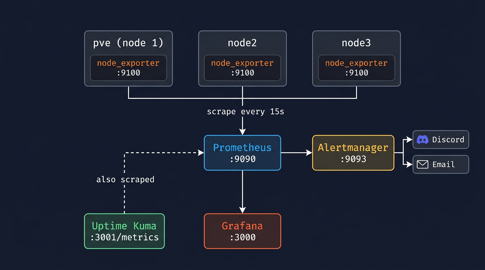

# Monitoring-Homelab
Monitoring multiple metrics and logs to have a clear overview of the current status a proxmox 3-node cluster. Using Prometheus &amp; Grafana. 

## who is this guide for?
This guide is written as a personal project to set up a enterprise level monitoring stack to monitor the health and security of my current 3-node proxmox cluster. I run multiple services on this cluster that need High Avalibility, Load Balancing and proper Monitoring. 

### components of monitoring
In my monitoring stack i will focus on:
1. Metrics
certain numbers that describe the current state of my system.
2. Visualisation
turning this data and information in to graphs an dashboards so i musn't do much work to understand the data and take action.
3. Alerting
automatically sending myself a notification. I am trying to achieve full proactive monitoring, but for the current situation i would not mind reactive monitoring. 

### The tools
*Prometheus* 
This will be the scraper (fetcher) of the metrics within my cluster. Prometheus will send an HTTP request to each target asking their current metrics. It will store these metrics with a timestamp. 

It pulls the data from the servers.

Promtheus uses PromQL as its Query Language and will use this to Query the metrics. It will keep this data for 180 days. 

*node_exporter*
This is a small program that sits in each monitored server and will read system information from the OS (Linux= /proc and /sys) and exposes it to the Prometheus port 9100.

*Grafana*
This application connects data sources and makes it visible as graphs, tables and many other visualization dashboards. All the data comes from Prometheus and will be shown in grafana. Grafana is connected to the prometheus dashboard.

*Alertmanager*
This program will handle all the alerts given by Prometheus. Within Prometheus there will be certain thresholds set by the administrator (me) and when this threshold will be hit there will be sent a certain alert.
The nice part of this application is that it will send certain alerts through a specific channel, like a not so critical alert through mail and a extremely high critical alert through a text message on Telegram.

## Architecture

